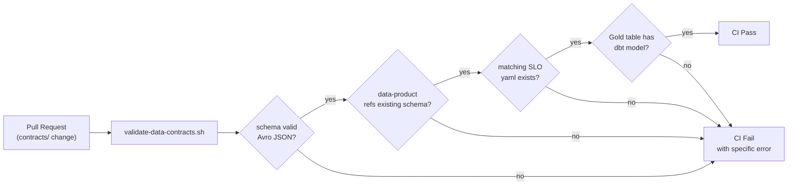

# AI Agents

This platform uses AI agents for tasks that require judgment — not for scripted transformation. The rule: **if the output is deterministic given structured input, write a script; if it requires reading domain context and making a decision, use an agent**.

---

## Human vs. Agent Responsibility

```
contracts/                   ← Human-authored only
├── schemas/*.avsc           ← Humans define wire format
└── data-products/*.yaml     ← Humans define SLAs, Gold schema, retention

         ↓  agents read contracts as input

pipeline/                    ← Agent-generated from contracts
├── debezium/*.json          ← Derived from schema namespace + DLQ settings
├── flink/silver_layer_job.py← Derived from schema + dedup rules
└── dbt/models/gold/*.sql    ← Derived from gold_tables[] schema

observability/               ← Agent-generated from data product SLAs
├── slos/*.yaml              ← Derived from slas.* targets
└── alerts/*.yaml            ← Derived from SLO + burn-rate formula

tooling/                     ← Scripts generated by agents; run forever after
├── validate-data-contracts.sh
└── generate-iceberg-ddl.py
```

---

## Agent Tasks

### Schema Authoring Agent

**Input**: Domain team's description of a new event (e.g., "payment confirmed event with amount, currency, and payment method")

**Output**: `contracts/schemas/payment-confirmed-v1.avsc` with Avro logicalTypes, UUID fields, `metadata.trace_id`, and namespace matching the domain

**Why an agent**: Choosing the correct logicalType (`decimal` vs `long` for amounts), deciding nullable vs union type for optional fields, and naming fields consistently with existing schemas requires reading the domain context and existing schema conventions — not just filling a template.

---

### DDL Generation Agent

**Input**: `contracts/data-products/*.yaml` Gold table schema section

**Output**: Iceberg DDL for the Gold table with correct field IDs, partition spec, and sort order

```python
# Example agent output for order_daily_summary
CREATE TABLE chakra_lakehouse.order_daily_summary (
    order_date          date            COMMENT 'Partition key',
    total_revenue_cents bigint          NOT NULL,
    unique_customers    bigint          NOT NULL,
    total_orders        bigint          NOT NULL,
    cancelled_orders    bigint,
    p99_order_value_cents bigint,
    updated_at          timestamptz     NOT NULL
)
USING iceberg
PARTITIONED BY (order_date)
TBLPROPERTIES (
    'write.format.default' = 'parquet',
    'write.parquet.compression-codec' = 'zstd'
);
```

**Why an agent**: The partition spec (date vs month vs identity), sort order optimization, and TBLPROPERTIES choices depend on query patterns described in the data product contract — not purely mechanical transformation.

---

### SLO YAML Generation Agent

**Input**: `contracts/data-products/*.yaml` `slas:` section

**Output**: `observability/slos/*.yaml` with the correct Prometheus metric names, burn-rate windows, and error budget math

**Why an agent**: The agent must map human-readable SLA descriptions ("Gold data must not be older than 5 minutes") to specific Prometheus metrics (`orders_gold_last_updated_timestamp_seconds`), determine the appropriate indicator type, and calculate the error budget correctly for the given window.

---

### Script Authoring Agent

**Input**: Description of a deterministic transformation task (e.g., "validate every data-product yaml references a schema that exists")

**Output**: `tooling/validate-data-contracts.sh` — a shell script that runs standalone

**Why an agent for a script**: Writing a robust validation script requires reasoning about edge cases, deciding what error messages are actionable, and structuring the exit code contract. Once written, the script runs forever without the agent — this is a one-time agent invocation, not a recurring one.

---

## What Agents Don't Touch

| File | Reason |
|---|---|
| `contracts/schemas/*.avsc` | Human-authored wire format — agent changes could silently break existing consumers |
| `contracts/data-products/*.yaml` | Human-authored SLA targets — changing these requires domain team sign-off |
| `observability/slos/*.yaml` (after initial generation) | SLO window and target changes require human review; these drive PagerDuty routing |
| `docs/adrs/` | ADR rationale requires human judgment about tradeoffs |

The `tooling/validate-data-contracts.sh` script enforces this: any pull request that modifies `contracts/` without a corresponding update to the downstream artifact fails CI.

---

## Validation Gate



This gate ensures that a domain team cannot publish a data product contract without the platform having the corresponding SLO, alert, and Gold table model in place. The contract-first model only works if the downstream is always in sync.
