# Medallion Layers

```mermaid
block-beta
    columns 4

    block:bronze:1
        BH["Bronze"]
        BL1["Raw CDC events"]
        BL2["No transforms"]
        BL3["90-day snapshots"]
        BL4["SLA: ≤ 30s"]
        BL5["Consumer: Flink only"]
    end

    space

    block:silver:1
        SH["Silver"]
        SL1["Envelope unwrapped"]
        SL2["Deduped · Validated"]
        SL3["1-year snapshots"]
        SL4["SLA: ≤ 2 min"]
        SL5["Consumer: Gold Flink · dbt"]
    end

    space

    block:gold:1
        GH["Gold"]
        GL1["Business aggregations"]
        GL2["Stable public schema"]
        GL3["2-year snapshots"]
        GL4["SLA: ≤ 5 min"]
        GL5["Consumer: Analysts · ML"]
    end

    bronze --> silver
    silver --> gold

    classDef bronze fill:#92400e,color:#fff,stroke:#92400e
    classDef silver fill:#1e3a5f,color:#fff,stroke:#1e3a5f
    classDef gold fill:#14532d,color:#fff,stroke:#14532d

    class BH,BL1,BL2,BL3,BL4,BL5 bronze
    class SH,SL1,SL2,SL3,SL4,SL5 silver
    class GH,GL1,GL2,GL3,GL4,GL5 gold
```



---

## Layer Contracts

=== "Bronze"

    **Purpose**: Complete audit record and Kappa reprocessing source.

    Nothing is filtered, transformed, or deduplicated. If Debezium emitted it, Bronze stores it — including heartbeat events, schema evolution tombstones, and operational metadata fields. Bronze is the recovery surface: if a Silver job has a bug, Silver is rebuilt by replaying Bronze, not by re-reading PostgreSQL.

    ```
    s3://chakra-lakehouse/bronze/{source_table}/year=YYYY/month=MM/day=DD/
    Partition:  ingestion date (not event date)
    Format:     Parquet + Snappy
    Retention:  90-day Iceberg snapshot expiry
    Schema:     Full Debezium envelope (before, after, source, op)
    Consumer:   Silver Flink job only — no analyst access
    ```

=== "Silver"

    **Purpose**: Trustworthy, analyst-safe copy of source tables.

    The Debezium `before`/`after` envelope is unwrapped — analysts see the current record, not the CDC wire format. Duplicate `event_id` values (from connector restarts) are suppressed by the 24-hour RocksDB dedup window. Malformed records are routed to DLQ with a structured failure reason; they never enter Silver silently.

    Type coercions and null normalizations are applied at this layer. A field typed as `string` in Avro but containing a timestamp is coerced to `timestamp_tz`. These coercions are defined in the Silver Flink job, not in the Avro schema — schema evolution and coercion are independent concerns.

    ```
    s3://chakra-lakehouse/silver/{domain}/{entity}/year=YYYY/month=MM/
    Partition:  event date (occurred_at)
    Format:     Parquet + ZSTD
    Retention:  365-day Iceberg snapshot expiry
    Schema:     Domain record fields only — no envelope
    Consumer:   Gold Flink job, dbt models, validation scripts
    ```

=== "Gold"

    **Purpose**: Stable public data product interface.

    Pre-computed business aggregations built by dbt incremental models. The Gold schema is declared in `contracts/data-products/orders-analytics.yaml` and is the stable interface that downstream consumers depend on. Schema changes require a contract update and PR review by the owning team — not just a dbt model change.

    Gold tables are partitioned by business date (not ingestion date) because analysts filter by order date, not pipeline run date. The `updated_at` column is the freshness signal that Prometheus scrapes to evaluate the Gold SLA.

    ```
    s3://chakra-lakehouse/gold/{data_product}/{model}/order_date=YYYY-MM-DD/
    Partition:  business date (order_date)
    Format:     Parquet + ZSTD
    Retention:  730-day Iceberg snapshot expiry (2 years)
    Schema:     Declared in contracts/data-products/*.yaml
    Consumer:   DuckDB, AWS Athena, ML feature stores, BI tools
    ```

---

## Schema Evolution Across Layers

Iceberg identifies columns by integer field ID, not by name. When a source column is renamed:

1. The Avro schema gets an alias for the old name (backward-compatible)
2. The Silver Flink job maps the alias to the new column name
3. Existing Silver Parquet files continue to read correctly — no rewrite needed
4. Gold dbt models reference the new name in SQL; old Gold partitions are unaffected

This means a column rename propagates from source to Gold without a migration job touching existing data files. The Iceberg field ID mapping absorbs the rename at the storage layer.

[:octicons-arrow-right-24: ADR-0004: Apache Iceberg](../../adrs/ADR-0004-apache-iceberg.md)

---

## Reprocessing via Kappa

When a Silver job has a bug and corrupts a partition, recovery uses the Bronze layer as the source of truth:

```
1. Reset flink-silver-orders consumer group to affected Bronze offset
2. Submit fixed Flink job pointing to a new Silver Iceberg table branch
3. Validate Silver output against known-good records
4. Swap Gold dbt source ref to the new Silver table
5. Expire old Silver snapshots
```

The 90-day Bronze retention window (set by `kafka_retention_days: 30` in the data product contract) is the maximum Kappa reprocessing window. Any corruption older than 90 days would require re-reading from PostgreSQL WAL archives.

[:octicons-arrow-right-24: ADR-0001: Kappa Architecture](../../adrs/ADR-0001-kappa-architecture.md)
