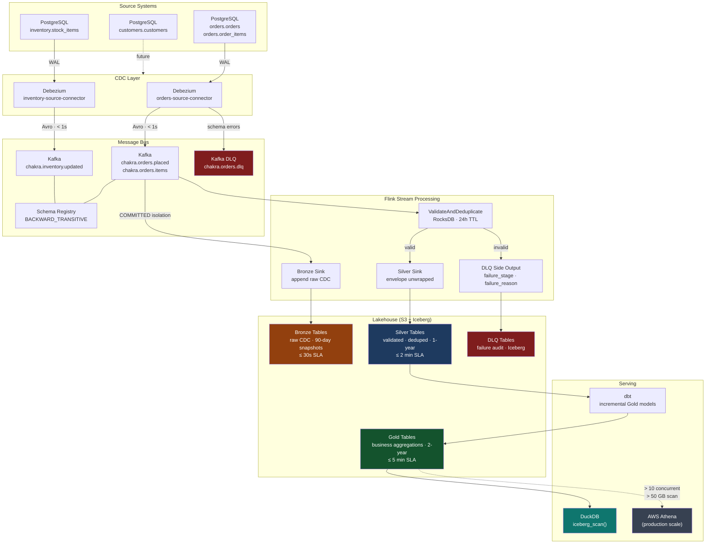

# Pipeline Flow

## SLA Checkpoints

Each arrow with a latency annotation is a machine-readable SLA defined in `contracts/data-products/orders-analytics.yaml`. A breach fires a Prometheus burn-rate alert that pages the `owner_team` defined in the same contract.

| Checkpoint | SLA | Metric |
|---|---|---|
| WAL → Kafka | < 1 second | Debezium connector lag |
| Kafka → Bronze Iceberg | ≤ 30 seconds | `orders_bronze_lag_seconds` |
| Bronze → Silver | ≤ 2 minutes | Kafka consumer lag (`flink-silver-orders` group) |
| Silver → Gold | ≤ 5 minutes | `orders_gold_last_updated_timestamp_seconds` |
