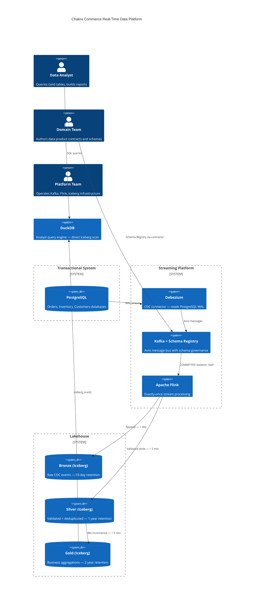

# Architecture

The platform makes one central architectural bet: a **single streaming path is simpler, cheaper, and more correct than a dual-path Lambda architecture** — if Flink provides exactly-once semantics and Iceberg provides transactional commits.

That bet is documented in [ADR-0001](../adrs/ADR-0001-kappa-architecture.md) with an explicit trigger condition: if Flink exactly-once semantics prove insufficient for a new use case, the platform would revisit the Lambda path. That trigger has not fired.

---

## Technology Stack

| Layer | Technology | Decision |
|---|---|---|
| CDC ingestion | Debezium + PostgreSQL WAL | [ADR-0003](../adrs/ADR-0003-debezium-cdc.md) |
| Message bus | Apache Kafka + Confluent Schema Registry | [ADR-0006](../adrs/ADR-0006-avro-schema-registry.md) |
| Stream processing | Apache Flink (PyFlink 1.18) | [ADR-0007](../adrs/ADR-0007-flink-stream-processing.md) |
| Lakehouse storage | Apache Iceberg v2 + S3 + AWS Glue | [ADR-0004](../adrs/ADR-0004-apache-iceberg.md) |
| Gold modeling | dbt (Iceberg adapter) | [ADR-0002](../adrs/ADR-0002-medallion-architecture.md) |
| Analyst serving | DuckDB | [ADR-0005](../adrs/ADR-0005-duckdb-serving-layer.md) |
| Schema governance | Avro + BACKWARD_TRANSITIVE | [ADR-0006](../adrs/ADR-0006-avro-schema-registry.md) |
| Domain ownership | Data product contracts | [ADR-0008](../adrs/ADR-0008-data-product-ownership.md) |

---

## Component Boundaries



---

## Contract-First Design

`contracts/` is the single interface between domain teams and the platform. Domain teams define *what the data must look like and how fresh it must be*. The platform implements *how to get it there*.

```
Domain Team Authors               Platform Implements
─────────────────────             ────────────────────
contracts/schemas/*.avsc    →     Debezium value.converter
                            →     Flink AvroRowDeserializationSchema
                            →     Silver Iceberg table DDL

contracts/data-products/    →     Gold Iceberg table DDL
  *.yaml                    →     observability/slos/*.yaml
  slas.gold_freshness       →     Prometheus burn-rate alerts
  kafka_retention_days      →     MSK topic retention setting
  owner_team                →     PagerDuty routing
```

This boundary is enforced by `tooling/validate-data-contracts.sh`: a domain team cannot merge a schema change without the platform artifacts being in sync.

---

## Diagrams

- [Pipeline Flow](diagrams/pipeline-flow.md) — End-to-end data movement from WAL to analyst query
- [Medallion Layers](diagrams/medallion-layers.md) — Bronze/Silver/Gold boundaries, SLAs, and consumers
