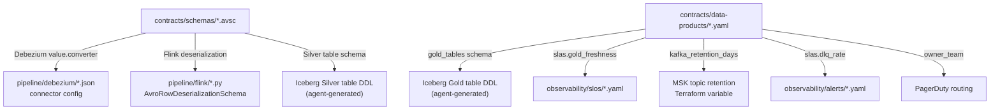

# Contracts

`contracts/` is the only directory domain teams author directly. Every downstream artifact — Debezium connector configs, Flink job schemas, Iceberg table DDL, SLO YAML files, Kafka retention settings — is derived from or generated by these files.

---

## Avro Schemas

Every Kafka topic has a schema in `contracts/schemas/`. These are the wire format contracts: producers and consumers are bound to them. Schema evolution follows `BACKWARD_TRANSITIVE` compatibility (ADR-0006).

Schemas use Avro [logical types](https://avro.apache.org/docs/current/spec.html#Logical+Types) throughout — `uuid` for identifiers, `timestamp-millis` for all timestamps. This makes field intent unambiguous and ensures correct deserialization in Flink and Iceberg without ad-hoc parsing.

=== "order-placed-v1.avsc"
    ```json
    {
      "type": "record",
      "name": "OrderPlaced",
      "namespace": "com.chakraview.orders.events.v1",
      "fields": [
        { "name": "event_id",    "type": { "type": "string", "logicalType": "uuid" } },
        { "name": "occurred_at", "type": { "type": "long",   "logicalType": "timestamp-millis" } },
        { "name": "order_id",    "type": { "type": "string", "logicalType": "uuid" } },
        ...
        { "name": "metadata", "type": { "type": "record", "name": "EventMetadata",
            "fields": [{ "name": "trace_id", "type": "string" }] } }
      ]
    }
    ```
    [Full schema →](https://github.com/naren-chakraview/chakraview-realtime-data-platform/blob/main/contracts/schemas/order-placed-v1.avsc)

=== "inventory-updated-v1.avsc"
    CDC envelope schema — includes `operation` enum (INSERT/UPDATE/DELETE/READ), `before`/`after` union types, and `source.lsn` for WAL sequence ordering.

    ```json
    {
      "name": "operation",
      "type": { "type": "enum", "name": "CdcOperation",
                "symbols": ["INSERT", "UPDATE", "DELETE", "READ"] }
    }
    ```
    [Full schema →](https://github.com/naren-chakraview/chakraview-realtime-data-platform/blob/main/contracts/schemas/inventory-updated-v1.avsc)

---

## Data Product Contracts

Each data product is defined by a YAML file in `contracts/data-products/`. This file is the boundary between a domain team's responsibility and the platform team's responsibility.

A data product contract specifies:

| Section | What it defines | Who uses it |
|---|---|---|
| `slas.ingestion_freshness` | Max lag Bronze ≤ 30s | Alert generation script |
| `slas.gold_freshness` | Max lag Gold ≤ 5 min | SLO YAML, Prometheus alert |
| `slas.dlq_rate` | Max DLQ events/hour | Alert threshold |
| `kafka_retention_days` | Kappa reprocessing window | MSK topic config |
| `gold_tables[].schema` | Public Gold layer interface | Iceberg DDL generation |
| `dead_letter.fields` | DLQ record schema | Flink DLQ sink, audit queries |
| `owner_team` | Who is paged on SLA breach | PagerDuty routing |

!!! example "orders-analytics.yaml highlights"
    ```yaml
    slas:
      gold_freshness:
        max_lag_minutes: 5
        error_budget_minutes: 43.2
        window: 30d

    gold_tables:
      - name: order_daily_summary
        schema:
          - { name: order_date,          type: date }
          - { name: total_revenue_cents, type: long }
          - { name: unique_customers,    type: long }
          - { name: updated_at,          type: timestamp_tz }
    ```
    [Full contract →](https://github.com/naren-chakraview/chakraview-realtime-data-platform/blob/main/contracts/data-products/orders-analytics.yaml)

---

## How Contracts Flow Downstream



---

## Validation

`tooling/validate-data-contracts.sh` (generated by Script Authoring Agent) checks:

1. Every `contracts/schemas/*.avsc` is valid Avro JSON
2. Every `contracts/data-products/*.yaml` references a schema that exists in `contracts/schemas/`
3. Every data product has a matching `observability/slos/*.yaml`
4. Every Gold table name in a data product has a matching dbt model in `pipeline/dbt/models/gold/`

Run locally: `bash tooling/validate-data-contracts.sh`
