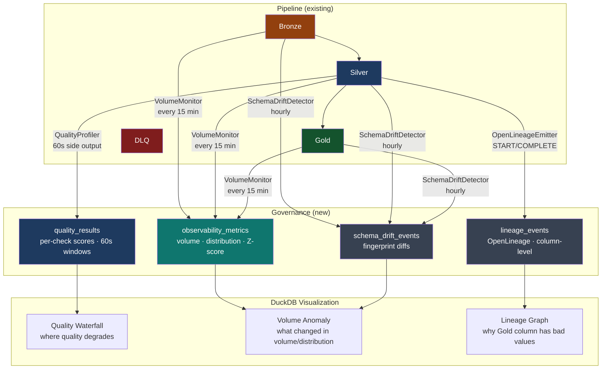

# Data Governance

Three governance layers sit alongside the medallion pipeline. Each stores results in `s3://chakra-lakehouse/governance/` as Iceberg tables — queryable by the same DuckDB connection used for analyst queries, with the same time-travel capabilities.



[:octicons-arrow-right-24: ADR-0009: Data Governance decisions](../adrs/ADR-0009-data-governance.md)

---

## Data Quality

**Where**: `governance/quality/quality_rules.yaml` (rules) · `governance/quality/quality_checker.py` (Flink profiler)

**What it captures**: Quality scores per business rule per 60-second window, for each pipeline stage from Bronze ingestion through Gold aggregation.

Quality rules are human-authored YAML, matching the same discipline as `contracts/`:

```yaml
# governance/quality/quality_rules.yaml
- stage: silver_validation
  table: silver.orders
  checks:
    - name: items_total_consistency
      dimension: consistency
      rule: column_sum_equals
      threshold: 0.999    # 99.9% of orders must have matching totals
```

The `QualityProfiler` runs as a 60-second tumbling window side output — a separate branch from the Silver write path. Quality checks never delay or block data delivery.

### The Quality Waterfall

The primary instability visualization. Shows quality scores at each pipeline stage in order:

```sql
-- governance/dashboards/quality_overview.sql — Query 1
```

Example output showing a Silver-stage problem:

```
Stage                  Records   Quality     Status
──────────────────     ───────   ───────     ──────
1. Bronze Ingestion    100,000   100.00%     ✓
2. Silver Validation    94,000    94.00%     ✗  ← instability identified here
3. Silver Dedup         93,900    93.90%     ✗
4. Gold Aggregation     93,900    93.90%     ✗
```

The drop between Bronze (100%) and Silver (94%) immediately identifies that 6% of records are failing Silver business rule validation. The waterfall collapses a complex multi-stage pipeline into a single, interpretable view.

**DLQ correlation**: `sample_failure_ids` in each quality result stores up to 10 `event_id` values. Join these against the DLQ Iceberg table to get the full failure context including the original Avro bytes.

```sql
-- Join quality failures to DLQ records for full context
SELECT q.check_name, q.failed_record_count, d.failure_reason, d.raw_payload
FROM iceberg_scan('s3://chakra-lakehouse/governance/quality_results/') q
JOIN iceberg_scan('s3://chakra-lakehouse/bronze/orders-analytics/dlq/') d
  ON d.original_offset IN (
     SELECT UNNEST(FROM_JSON(q.sample_failure_ids, '["VARCHAR"]'))
  )
WHERE q.evaluated_at >= NOW() - INTERVAL 1 HOUR;
```

---

## Data Observability

**Where**: `governance/observability/volume_monitor.py` · `governance/observability/schema_drift_detector.py`

**What it captures**: Row counts, null rates, and distribution statistics per table per partition — with Z-score anomaly detection against a 7-day baseline.

### Volume Anomaly Detection

The `VolumeMonitor` runs every 15 minutes and computes:

| Metric | What it catches |
|---|---|
| `row_count` | Connector failure (drops to 0), duplicate ingestion (doubles) |
| `null_rate_{column}` | Producer bug that starts sending null for a required field |
| `mean_{column}` | Business data drift (e.g., average order size climbing unexpectedly) |
| `stddev_{column}` | Distribution widening (e.g., pricing bug causing outliers) |
| `distinct_count_{column}` | Cardinality collapse (e.g., customer_id starts repeating) |

Anomaly threshold: `|Z-score| > 3.0` (standard deviations from 7-day rolling mean). This threshold catches operational failures while tolerating normal business variation (seasonal peaks are typically ≤ 2σ).

**Bronze–Silver divergence query**:

```sql
-- A widening gap between Bronze and Silver row counts means more records
-- are being rejected by Silver validation — quality is degrading
SELECT
    partition_date,
    bronze_rows - silver_rows  AS rejected_in_silver,
    ROUND((bronze_rows - silver_rows) * 100.0 / bronze_rows, 3) AS "rejection_%"
FROM (query 2 in observability_overview.sql)
```

### Schema Drift Detection

The `SchemaDriftDetector` compares Iceberg schema fingerprints hourly. Drift types and their safety implications:

| Drift Type | Iceberg Safety | Query Impact | Alert Severity |
|---|---|---|---|
| `COLUMN_ADDED` | Safe — field ID preserved | New column visible immediately | Info |
| `RENAME` | Safe — field ID unchanged | Old name alias needed in queries | Info |
| `COLUMN_DROPPED` | Safe for files | Existing SQL breaks | Warning |
| `TYPE_CHANGED` (widening) | Safe (int→long, float→double) | No impact | Info |
| `TYPE_CHANGED` (other) | Unsafe — breaks reads | Deserialization failure | Error |

---

## Data Lineage

**Where**: `governance/lineage/openlineage_emitter.py`

**What it captures**: Column-level lineage for every pipeline run, stored in OpenLineage format and queryable as an Iceberg table.

### Column Lineage Map

The lineage map is explicit — declared in the emitter, not inferred:

```
kafka://chakra.orders.placed.total_amount_cents  ──direct_copy──►  silver.orders.total_amount_cents
                                                                           │
                                                                    aggregate_sum
                                                                           │
                                                                           ▼
                                                              gold.order_daily_summary.total_revenue_cents
```

### Forward Impact Analysis

"If I rename `total_amount_cents` in the Avro schema, which Gold columns are affected?"

```sql
-- governance/dashboards/lineage_graph.sql — Query 2 (Forward Impact)
SELECT source_field, output_column, transform_type, produced_by
FROM (lineage edge query)
WHERE source_field = 'total_amount_cents';

-- Result:
-- total_amount_cents → silver.orders.total_amount_cents      (direct_copy,  silver-layer-orders)
-- total_amount_cents → gold.order_daily_summary.total_revenue_cents (aggregate_sum, dbt:order_daily_summary)
-- total_amount_cents → gold.order_daily_summary.avg_order_cents     (aggregate_avg, dbt:order_daily_summary)
```

### Backward Trace

"Gold `total_revenue_cents` is wrong this week — what's the root cause?"

```sql
-- Query 3 (Backward Trace)
SELECT source_dataset, source_field, transform_type, transformation_step
FROM (lineage edge query)
WHERE output_column = 'total_revenue_cents';

-- Result:
-- kafka://chakra.orders.placed → total_amount_cents  (direct_copy → aggregate_sum)
-- system → dbt_run_timestamp  (updated_at only)
```

The trace tells you to check `total_amount_cents` in the Avro source events — likely a producer-side bug.

---

## Governance Data Locations

| Table | Path | Retention |
|---|---|---|
| `quality_results` | `s3://chakra-lakehouse/governance/quality_results/` | 90 days |
| `observability_metrics` | `s3://chakra-lakehouse/governance/observability_metrics/` | 90 days |
| `lineage_events` | `s3://chakra-lakehouse/governance/lineage_events/` | 90 days |
| `schema_drift_events` | `s3://chakra-lakehouse/governance/schema_drift_events/` | 365 days |

All tables use Iceberg v2 with the same AWS Glue catalog as the medallion layers. Time travel works identically: `iceberg_scan('...', version = '2024-03-14T00:00:00')` queries governance data as it existed at that timestamp.
