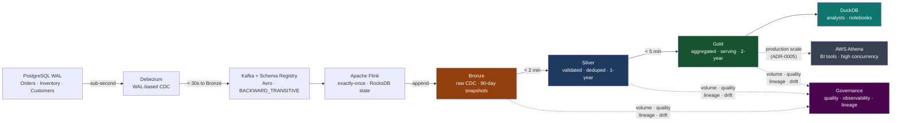

# Real-Time Data Platform

> Domain teams author data product contracts — schemas, freshness SLAs, quality invariants. The pipeline topology is derived from those contracts by agents. The contract is the only source of truth the platform ever trusts.

---

## What This Is

The Chakra Commerce transactional system generates order events, inventory changes, and customer registrations continuously. This platform captures every committed database change via CDC, streams it through a validated pipeline, and lands it in a lakehouse where analysts query Gold-layer tables with sub-second latency.

The architecture makes one opinionated choice above all others: **a single streaming path, no batch layer**. Apache Flink's exactly-once semantics and Iceberg's time travel make the correctness argument for a separate batch layer obsolete.

---

## At a Glance

-   :material-database-arrow-right:{ .lg .middle } __Kappa Architecture__

    ---

    One Flink pipeline from WAL to Gold. Reprocessing means replaying the Kafka log from the start — no dual-codebase Lambda complexity.

    [:octicons-arrow-right-24: ADR-0001](adrs/ADR-0001-kappa-architecture.md)

-   :material-layers-triple:{ .lg .middle } __Medallion Layers__

    ---

    Bronze (raw CDC) → Silver (validated, deduplicated) → Gold (aggregated, serving-ready). Each layer has its own SLA and consumer contract.

    [:octicons-arrow-right-24: ADR-0002](adrs/ADR-0002-medallion-architecture.md)

-   :material-duck:{ .lg .middle } __DuckDB Serving Layer__

    ---

    Analysts query Gold-layer Iceberg tables with zero infrastructure. AWS Athena is the documented production-scale path with explicit threshold criteria.

    [:octicons-arrow-right-24: ADR-0005](adrs/ADR-0005-duckdb-serving-layer.md)

-   :material-shield-check:{ .lg .middle } __8 Patterns, 9 ADRs__

    ---

    CDC, Kappa, Medallion, Schema Registry, exactly-once semantics, watermarking, DLQ, and data product ownership — each backed by an accepted ADR.

    [:octicons-arrow-right-24: Pattern Catalogue](patterns/index.md)

-   :material-chart-timeline-variant:{ .lg .middle } __Data Governance__

    ---

    Quality checks, volume anomaly detection, and column-level lineage — stored as Iceberg tables and queryable by DuckDB. Pinpoint pipeline instability with the quality waterfall.

    [:octicons-arrow-right-24: Governance](governance/index.md)

---

## The Pipeline

---

## The Contract-First Model

`contracts/` is the only directory domain teams author directly. Everything downstream is derived or generated.

| Human-authored | Derived artifact |
|---|---|
| `contracts/schemas/*.avsc` | Debezium serialization config |
| `contracts/schemas/*.avsc` | Flink deserialization + Silver table schema |
| `contracts/data-products/*.yaml` | Iceberg Gold table DDL |
| `contracts/data-products/*.yaml` | `observability/slos/*.yaml` + burn-rate alerts |
| `contracts/data-products/*.yaml` | Kafka topic retention settings |

[:octicons-arrow-right-24: Explore the contracts](contracts/index.md)

---

## Freshness SLAs

Every layer has a machine-readable SLA target in `contracts/data-products/`. These flow to Prometheus alerts via the same script-driven pipeline used in the enterprise modernization repo.

| Layer | Freshness SLA | Measured by |
|---|---|---|
| Bronze | ≤ 30 seconds from WAL commit | `orders_bronze_lag_seconds` |
| Silver | ≤ 2 minutes from Bronze write | Kafka consumer lag: `flink-silver-orders` |
| Gold | ≤ 5 minutes from source event | `orders_gold_last_updated_timestamp_seconds` |

A single SLA breach — Gold data older than 5 minutes — triggers a multi-window burn rate alert at the same rates used in the enterprise modernization SLOs (14.4× fast burn, 6× slow burn).

[:octicons-arrow-right-24: Observability setup](observability/index.md)

---

## Data Governance

Quality checks, volume monitoring, and column-level lineage run alongside every pipeline stage and store results as Iceberg tables — queryable by DuckDB alongside the medallion data.

| Layer | What is measured |
|---|---|
| Quality | Per-rule pass rate every 60 seconds; quality waterfall across Bronze → Silver → Gold |
| Observability | Row count Z-score, null rates, distribution drift, schema fingerprint comparison |
| Lineage | Column-level source→Gold map; forward impact and backward root-cause queries |

[:octicons-arrow-right-24: Governance](governance/index.md) · [:octicons-arrow-right-24: ADR-0009](adrs/ADR-0009-data-governance.md)
