# Observability

Every SLA target in `contracts/data-products/` flows to a machine-readable SLO in `observability/slos/` and a Prometheus alert in `observability/alerts/`. The pipeline is not considered healthy unless the Gold layer is within its freshness window.

---

## SLO Definitions

[`observability/slos/orders-analytics-slo.yaml`](https://github.com/naren-chakraview/chakraview-realtime-data-platform/blob/main/observability/slos/orders-analytics-slo.yaml)

```yaml
service: orders-analytics-pipeline
owner_team: orders-team            # paged on SLA breach — matches contracts/data-products/

slos:
  - name: gold_freshness
    description: "Gold layer updated within 5 minutes of source event"
    target: 99.9
    window: 30d
    indicator:
      type: metric
      metric: orders_gold_last_updated_timestamp_seconds
      good_condition: "(time() - orders_gold_last_updated_timestamp_seconds) < 300"

  - name: pipeline_availability
    description: "Flink job is running and checkpointing"
    target: 99.9
    window: 30d
    indicator:
      type: metric
      metric: flink_jobmanager_job_uptime
      good_condition: "flink_jobmanager_job_uptime > 0"

  - name: dlq_rate
    description: "DLQ events below threshold (< 10/hour)"
    target: 99.5
    window: 30d
    indicator:
      type: metric
      metric: orders_dlq_events_total
      good_condition: "rate(orders_dlq_events_total[1h]) < 10"
```

The SLO spec references metrics by name. The Flink job registers these metrics via the PyFlink metrics API; dbt exposes `updated_at` which Prometheus scrapes via a custom exporter.

---

## Burn-Rate Alerts

Multi-window burn-rate alerting fires before the error budget is exhausted. The math is derived from the same approach used in Google SRE:

| Window | Burn rate | Alert | Severity |
|---|---|---|---|
| 1h / 5h | 14.4× | > 2% budget in 1h | Page immediately |
| 6h / 30h | 6× | > 5% budget in 6h | Page (slower burn) |

For the Gold freshness SLO at 99.9% over 30 days:
- Error budget = 0.1% × 30 × 24 × 60 min = **43.2 minutes**
- 14.4× burn rate alert fires when staleness would exhaust 43.2 min budget in < 1 hour

```yaml
# observability/alerts/orders-freshness-burnrate.yaml
groups:
  - name: orders.freshness.burnrate
    rules:
      - alert: OrdersGoldStaleFastBurn
        expr: |
          (
            (time() - orders_gold_last_updated_timestamp_seconds) > 300
          ) and (
            (time() - orders_gold_last_updated_timestamp_seconds) > 300
          )
        for: 2m
        labels:
          severity: critical
          team: orders-team
        annotations:
          summary: "Gold layer freshness SLA breach — fast burn"
          runbook: "https://naren-chakraview.github.io/chakraview-realtime-data-platform/runbooks/gold-freshness-breach/"

      - alert: OrdersGoldStaleSlowBurn
        expr: |
          (time() - orders_gold_last_updated_timestamp_seconds) > 180
        for: 30m
        labels:
          severity: warning
          team: orders-team
```

---

## Freshness Metrics

The pipeline exposes three distinct freshness metrics — one per medallion layer:

| Metric | Source | SLA |
|---|---|---|
| `orders_bronze_lag_seconds` | Debezium Kafka consumer lag | ≤ 30s |
| `flink_kafka_consumer_lag` (consumer group: `flink-silver-orders`) | Kafka consumer lag API | ≤ 2 min |
| `orders_gold_last_updated_timestamp_seconds` | dbt model `updated_at` column | ≤ 5 min |

```mermaid
flowchart LR
    WAL["WAL commit"]
    KF["Kafka offset"]
    BR["Bronze write"]
    SV["Silver write"]
    GD["Gold updated_at"]
    PR["Prometheus"]
    AL["Alert manager"]

    WAL -->|"orders_bronze_lag_seconds ≤ 30s"| KF
    KF -->|"consumer lag ≤ 2min"| BR
    BR -->|"Flink checkpoint"| SV
    SV -->|"dbt incremental"| GD
    GD -->|"scrape"| PR
    PR -->|"burn-rate rule"| AL

    style GD fill:#14532d,color:#fff
    style AL fill:#7f1d1d,color:#fff
```



---

## DLQ Monitoring

DLQ events are written to Iceberg (`s3://chakra-lakehouse/dlq/orders/`) with structured fields. The `orders_dlq_events_total` counter is incremented per record by the Flink DLQ side output.

The DLQ audit query in [`serving/duckdb/queries/order_analytics.sql`](https://github.com/naren-chakraview/chakraview-realtime-data-platform/blob/main/serving/duckdb/queries/order_analytics.sql) surfaces hourly failure counts by stage and reason — mapped to a Grafana panel.

**Failure modes and their alert signatures:**

| `failure_stage` | `failure_reason` | Indicates |
|---|---|---|
| `bronze_validation` | `schema_mismatch` | Producer published incompatible schema — Schema Registry enforcement gap |
| `silver_validation` | `empty_items_array` | Order event with no line items — upstream business logic bug |
| `silver_validation` | `total_mismatch` | Line item sum ≠ total — calculation error in producer |
| `silver_dedup` | `duplicate_event_id` | Connector restart — normal; spikes indicate instability |
| `silver_watermark` | `late_arrival` | Consumer lag exceeding 5-min tolerance — capacity issue |

A sustained rise in `silver_dedup:duplicate_event_id` without a matching deployment event in Debezium typically indicates slot slot drift or connector instability — not a data quality issue.

---

## Dashboard Structure

```
observability/dashboards/
├── pipeline-overview.json   # Throughput, lag, checkpoint duration, DLQ rate
├── freshness-sla.json       # Bronze/Silver/Gold freshness gauges + error budget burn
└── dlq-audit.json           # Hourly DLQ counts by stage and reason
```

---

## Governance Layer — Quality and Volume Observability

The SLOs above measure **when** data arrives. The governance layer measures **whether the data is correct** and **whether volumes are behaving normally**. The two are complementary: a freshness SLA can be green while 6% of Silver records silently fail a business rule.

| Observability layer | What it watches | Where results go |
|---|---|---|
| Freshness SLOs (this page) | Time from WAL commit to Gold table | Prometheus → PagerDuty |
| Quality checks | Per-rule pass rates at each pipeline stage | `governance/quality_results/` Iceberg |
| Volume monitor | Row counts and distribution Z-scores | `governance/observability_metrics/` Iceberg |
| Schema drift | Iceberg schema fingerprint changes | `governance/schema_drift_events/` Iceberg |

The **quality waterfall** query in [`governance/dashboards/quality_overview.sql`](https://github.com/naren-chakraview/chakraview-realtime-data-platform/blob/main/governance/dashboards/quality_overview.sql) is the primary instability visualization — it shows quality scores at each stage in order so degradation is immediately locatable.

[:octicons-arrow-right-24: Data Governance](../governance/index.md)

The freshness SLA dashboard is the on-call view: it shows the current staleness of each medallion layer against its SLA threshold in green/amber/red. An amber state means the slow-burn alert has fired but the fast-burn has not — the on-call team has ~30 minutes before page escalation.
