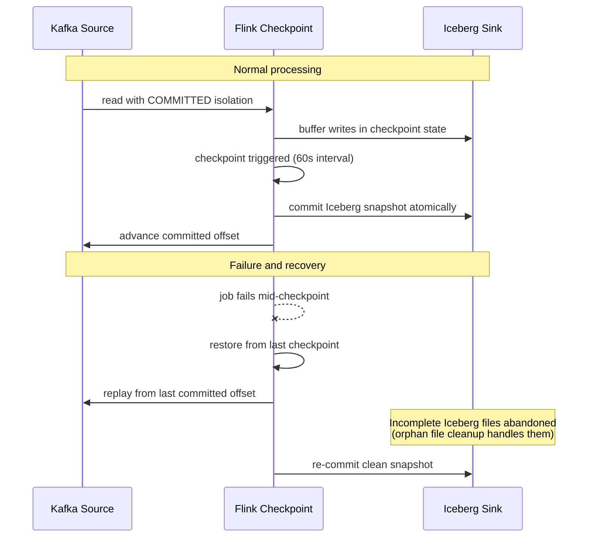
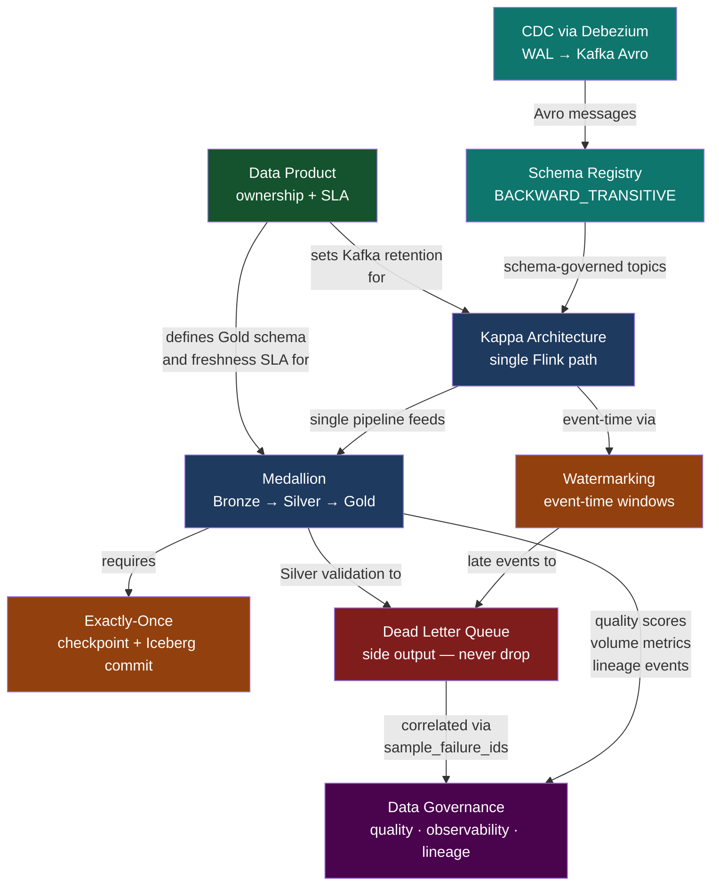

# Pattern Catalogue

Eight patterns are demonstrated in this platform. Each is backed by an ADR, a concrete implementation file, and links to the contract that motivates it.

---

## CDC via Debezium

**ADR**: [ADR-0003](../adrs/ADR-0003-debezium-cdc.md) · **Type**: Ingestion

Change Data Capture reads the PostgreSQL Write-Ahead Log directly. No polling, no `updated_at` timestamp columns, no application code changes. Every INSERT, UPDATE, and DELETE is captured with the full before/after state within milliseconds of the database commit.

The critical operational decision: each connector gets a **dedicated replication slot**. A shared slot would stall WAL recycling whenever one connector fell behind, growing disk usage unboundedly. Heartbeat events every 30 seconds prevent idle-table slots from blocking WAL recycling even when no data changes occur.

!!! example "Reference Implementation"
    | File | Purpose |
    |---|---|
    | [`pipeline/debezium/orders-source-connector.json`](https://github.com/naren-chakraview/chakraview-realtime-data-platform/blob/main/pipeline/debezium/orders-source-connector.json) | Full connector config: slot name, heartbeats, SMTs, DLQ routing, offset storage topic |
    | [`contracts/schemas/inventory-updated-v1.avsc`](https://github.com/naren-chakraview/chakraview-realtime-data-platform/blob/main/contracts/schemas/inventory-updated-v1.avsc) | Avro schema with `before`/`after`/`source.lsn` envelope — the CDC output contract |

**Key config choices in the connector:**
```json
"slot.name":           "debezium_orders",
"heartbeat.interval.ms": "30000",
"offset.storage.topic": "_debezium_offsets",
"errors.deadletterqueue.topic.name": "chakra.orders.dlq"
```

---

## Kappa Architecture

**ADR**: [ADR-0001](../adrs/ADR-0001-kappa-architecture.md) · **Type**: Architecture

A single Apache Flink pipeline handles all data from source to Gold. There is no batch layer, no dual codebase, no nightly reconciliation job. When a Flink job bug corrupts Silver data, reprocessing means replaying the Kafka log from the affected offset with the fixed job — the same code path that runs continuously.

This was only viable once Flink achieved true exactly-once semantics. Without it, the correctness guarantee required a separate batch layer (Lambda). Flink 1.15+ with Iceberg's transactional commit protocol eliminates that requirement.

!!! example "Reference Implementation"
    | File | Purpose |
    |---|---|
    | [`pipeline/flink/silver_layer_job.py`](https://github.com/naren-chakraview/chakraview-realtime-data-platform/blob/main/pipeline/flink/silver_layer_job.py) | The single processing path: Kafka → validate → deduplicate → Iceberg Silver |
    | [`contracts/data-products/orders-analytics.yaml`](https://github.com/naren-chakraview/chakraview-realtime-data-platform/blob/main/contracts/data-products/orders-analytics.yaml) | `kafka_retention_days: 30` — the Kappa reprocessing window |

**Reprocessing procedure** (documented in ADR-0001):

1. Reset consumer group offset to the beginning of the affected window
2. Submit new Flink job version pointing to a new Iceberg table branch
3. Validate Silver output against known-good records
4. Swap Gold-layer table pointer in the Glue catalog
5. Expire the old Silver snapshots

---

## Medallion Architecture

**ADR**: [ADR-0002](../adrs/ADR-0002-medallion-architecture.md) · **Type**: Storage / Quality

Three Iceberg table layers, each with different quality guarantees, retention, and consumers:

=== "Bronze"
    **Raw CDC events — exactly what Debezium captured.**

    No transformations. No filtering. No deduplication. If Debezium emitted it, Bronze stores it — including schema evolution events, heartbeats, and operational metadata. This is the complete audit record and the reprocessing source for Silver.

    ```
    Location:  s3://chakra-lakehouse/bronze/{source_table}/
    Retention: 90-day Iceberg snapshots
    SLA:       ≤ 30 seconds from WAL commit
    Consumers: Silver Flink job only
    ```

=== "Silver"
    **Validated, deduplicated, envelope-unwrapped.**

    The Debezium `before`/`after` envelope is unwrapped. Malformed records go to the DLQ side output. Duplicate event IDs (from connector restarts) are suppressed by a stateful RocksDB keyed process with 24-hour TTL. Type coercions and null normalisations are applied. This is where data quality SLAs are enforced.

    ```
    Location:  s3://chakra-lakehouse/silver/{domain}/{entity}/
    Retention: 365-day Iceberg snapshots
    SLA:       ≤ 2 minutes from Bronze write
    Consumers: Gold Flink job, dbt models, validation scripts
    ```

=== "Gold"
    **Business-level aggregations — the public data product interface.**

    Pre-computed summaries built by dbt models from Silver. The Gold schema is the stable interface that downstream consumers (analysts, ML pipelines, BI tools) depend on. Schema changes require a data product contract update and a PR review by the owning team.

    ```
    Location:  s3://chakra-lakehouse/gold/{data_product}/{model}/
    Retention: 730-day Iceberg snapshots (2 years)
    SLA:       ≤ 5 minutes from source event
    Consumers: DuckDB, AWS Athena, ML feature stores
    ```

!!! example "Reference Implementation"
    | File | Purpose |
    |---|---|
    | [`pipeline/flink/silver_layer_job.py`](https://github.com/naren-chakraview/chakraview-realtime-data-platform/blob/main/pipeline/flink/silver_layer_job.py) | Bronze → Silver: `ValidateAndDeduplicate` keyed process, DLQ side output |
    | [`pipeline/dbt/models/gold/order_daily_summary.sql`](https://github.com/naren-chakraview/chakraview-realtime-data-platform/blob/main/pipeline/dbt/models/gold/order_daily_summary.sql) | Silver → Gold: incremental Iceberg model with partitioning and freshness timestamp |
    | [`contracts/data-products/orders-analytics.yaml`](https://github.com/naren-chakraview/chakraview-realtime-data-platform/blob/main/contracts/data-products/orders-analytics.yaml) | Gold table schema, freshness SLAs per layer, DLQ thresholds |

---

## Avro + Schema Registry

**ADR**: [ADR-0006](../adrs/ADR-0006-avro-schema-registry.md) · **Type**: Schema Governance

Every Kafka topic uses Avro with `BACKWARD_TRANSITIVE` compatibility enforced by the Schema Registry. A producer cannot publish a message that breaks any existing consumer version — the Schema Registry rejects the write before the message reaches the broker.

`BACKWARD_TRANSITIVE` (not just `BACKWARD`) means any consumer schema version can read any historical message, including the full Kafka log. This makes the Kappa reprocessing guarantee complete: replaying from the earliest offset never encounters an incompatible schema.

!!! example "Reference Implementation"
    | File | Purpose |
    |---|---|
    | [`contracts/schemas/order-placed-v1.avsc`](https://github.com/naren-chakraview/chakraview-realtime-data-platform/blob/main/contracts/schemas/order-placed-v1.avsc) | Full Avro schema with logicalTypes: `uuid`, `timestamp-millis`; `metadata.trace_id` for tracing correlation |
    | [`contracts/schemas/inventory-updated-v1.avsc`](https://github.com/naren-chakraview/chakraview-realtime-data-platform/blob/main/contracts/schemas/inventory-updated-v1.avsc) | CDC envelope schema: `operation` enum, `before`/`after` union types, `source.lsn` for WAL ordering |

**Iceberg field ID benefit**: Iceberg identifies columns by integer field ID, not by name. When a source column is renamed, the Avro schema uses an alias; Iceberg's field ID mapping means existing Silver Parquet files are still readable without rewrite. Schema evolution propagates from source to Gold without a migration job.

---

## Exactly-Once Semantics

**ADR**: [ADR-0007](../adrs/ADR-0007-flink-stream-processing.md) · **Type**: Reliability

End-to-end exactly-once requires three components in concert:



The Kafka source reads with `COMMITTED` isolation — it only sees offsets from transactions that Debezium fully committed. Flink checkpoints capture all in-flight state. The Iceberg `FlinkSink` commits atomically on checkpoint boundaries. A failure at any point replays from the last checkpoint without producing duplicate rows.

!!! example "Reference Implementation"
    | File | Lines | Purpose |
    |---|---|---|
    | [`pipeline/flink/silver_layer_job.py`](https://github.com/naren-chakraview/chakraview-realtime-data-platform/blob/main/pipeline/flink/silver_layer_job.py) | `build_job()` | Checkpoint config: 60s interval, EXACTLY_ONCE mode, 30s min pause, 120s timeout |

---

## Watermarking and Late Event Handling

**ADR**: [ADR-0007](../adrs/ADR-0007-flink-stream-processing.md) · **Type**: Stream Processing

The pipeline uses **event-time processing** — windows are computed based on when events occurred at the source database, not when Flink received them. This means a Kafka lag spike doesn't corrupt windowed aggregations; events are placed in the correct window regardless of when they arrive.

`BoundedOutOfOrdernessWatermarkStrategy` with a 5-minute tolerance (derived from the p99 consumer lag SLA in `contracts/data-products/`). Events arriving more than 5 minutes after the watermark go to a **side output stream** — they are written to the DLQ Bronze table with `late_arrival: true`. They are never silently dropped.

!!! example "Reference Implementation"
    ```python
    # pipeline/flink/silver_layer_job.py
    watermark_strategy = (
        WatermarkStrategy
        .for_bounded_out_of_orderness(Duration.of_minutes(5))
        .with_timestamp_assigner(lambda event, _: event["occurred_at"])
    )
    ```
    [`View in context →`](https://github.com/naren-chakraview/chakraview-realtime-data-platform/blob/main/pipeline/flink/silver_layer_job.py)

---

## Dead Letter Queue

**Type**: Reliability / Data Quality

Events are never silently dropped. Three failure modes route to the DLQ side output:

| Failure mode | `failure_stage` | `failure_reason` |
|---|---|---|
| Avro deserialization error | `bronze_validation` | `schema_mismatch` |
| Business rule violation | `silver_validation` | `empty_items_array`, `total_mismatch`, `non_positive_total` |
| Duplicate event ID | `silver_dedup` | `duplicate_event_id` |
| Late arrival beyond watermark tolerance | `silver_watermark` | `late_arrival` |

Every DLQ record includes the original Avro bytes (`raw_payload`), the Kafka offset, the failure reason, and the pipeline stage — enough information to replay the event through a corrected pipeline without re-reading from the source database.

!!! example "Reference Implementation"
    | File | Purpose |
    |---|---|
    | [`contracts/data-products/orders-analytics.yaml`](https://github.com/naren-chakraview/chakraview-realtime-data-platform/blob/main/contracts/data-products/orders-analytics.yaml) | `dead_letter` block: DLQ topic, Iceberg table location, field schema |
    | [`serving/duckdb/queries/order_analytics.sql`](https://github.com/naren-chakraview/chakraview-realtime-data-platform/blob/main/serving/duckdb/queries/order_analytics.sql) | DLQ rate audit query: hourly counts by failure stage and reason |

---

## Data Product Ownership

**ADR**: [ADR-0008](../adrs/ADR-0008-data-product-ownership.md) · **Type**: Governance

Each bounded context (Orders, Inventory, Customers) owns its data product: the Avro schema, the freshness SLA, the Gold-layer table definition, and the on-call responsibility when the SLA is breached. The data platform team owns the runtime — Kafka, Flink, Iceberg, Glue — but not the contracts.

This mirrors the enterprise modernization repo's human-AI model: the domain team authors the *what* (the contract); the platform team and agents handle the *how* (the implementation).

```
contracts/data-products/orders-analytics.yaml
│
├── owner_team: orders-team          → paged when Gold SLA breaches
├── slas.gold_freshness.max: 5 min  → drives alert threshold
├── gold_tables[].schema            → Iceberg table DDL generated by agent
└── kafka_retention_days: 30        → MSK topic config parameter
```

!!! example "Reference Implementation"
    | File | Purpose |
    |---|---|
    | [`contracts/data-products/orders-analytics.yaml`](https://github.com/naren-chakraview/chakraview-realtime-data-platform/blob/main/contracts/data-products/orders-analytics.yaml) | Complete data product definition: SLAs, Gold schema, DLQ schema, Kafka retention |

---

## Pattern Interaction Map


