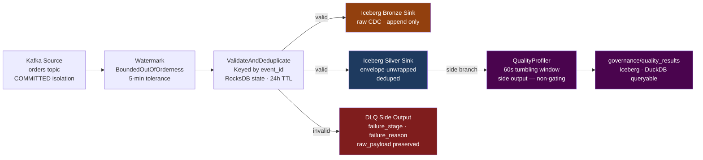
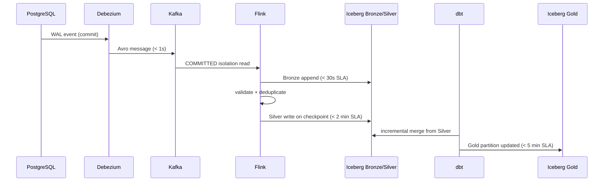

# Pipeline

Three implementation layers move data from PostgreSQL WAL to queryable Gold Iceberg tables. Every file is derived from or governed by a `contracts/` file — the pipeline has no independently-defined behavior.

---

## Debezium CDC

The entry point: PostgreSQL WAL → Kafka Avro messages within milliseconds of a database commit.

### Connector Configuration

[`pipeline/debezium/orders-source-connector.json`](https://github.com/naren-chakraview/chakraview-realtime-data-platform/blob/main/pipeline/debezium/orders-source-connector.json) — The complete source connector for the Orders domain.

```json
{
  "connector.class": "io.debezium.connector.postgresql.PostgresConnector",
  "database.server.name": "chakra",
  "table.include.list": "orders.orders,orders.order_items",

  "slot.name": "debezium_orders",
  "heartbeat.interval.ms": "30000",
  "offset.storage.topic": "_debezium_offsets",

  "key.converter": "io.confluent.kafka.serializers.KafkaAvroSerializer",
  "value.converter": "io.confluent.kafka.serializers.KafkaAvroSerializer",
  "value.converter.schema.registry.url": "${env:SCHEMA_REGISTRY_URL}",

  "errors.deadletterqueue.topic.name": "chakra.orders.dlq",
  "errors.deadletterqueue.topic.replication.factor": "3",

  "transforms": "unwrap,addMetadata",
  "transforms.unwrap.type": "io.debezium.transforms.ExtractNewRecordState",
  "transforms.unwrap.drop.tombstones": "false",
  "transforms.addMetadata.type": "org.apache.kafka.connect.transforms.InsertField$Value",
  "transforms.addMetadata.static.field": "pipeline_version",
  "transforms.addMetadata.static.value": "1.0.0"
}
```

**Key decisions:**

| Config | Value | Reason |
|---|---|---|
| `slot.name` | `debezium_orders` | Dedicated slot — shared slots block WAL recycling when any connector falls behind |
| `heartbeat.interval.ms` | `30000` | Idle tables still emit heartbeats; prevents slot from blocking WAL recycling |
| `offset.storage.topic` | `_debezium_offsets` | Kafka-native offset storage; survives connector restarts without external state |
| `errors.deadletterqueue` | `chakra.orders.dlq` | Schema violations route to DLQ rather than stalling the connector |

---

## Flink Stream Processing

[`pipeline/flink/silver_layer_job.py`](https://github.com/naren-chakraview/chakraview-realtime-data-platform/blob/main/pipeline/flink/silver_layer_job.py) — The single Flink job that covers Bronze → Silver. One code path for both production and Kappa reprocessing.

### Job Architecture



The `QualityProfiler` runs as a **separate window branch** — it never delays the Silver write path. It evaluates all rules from [`governance/quality/quality_rules.yaml`](https://github.com/naren-chakraview/chakraview-realtime-data-platform/blob/main/governance/quality/quality_rules.yaml) against each 60-second batch and writes quality scores to the governance Iceberg table.

[:octicons-arrow-right-24: Data Governance](../governance/index.md)

### Watermark Strategy

```python
watermark_strategy = (
    WatermarkStrategy
    .for_bounded_out_of_orderness(Duration.of_minutes(5))
    .with_timestamp_assigner(lambda event, _: event["occurred_at"])
)
```

The 5-minute tolerance is derived from the `p99_consumer_lag_minutes` field in `contracts/data-products/orders-analytics.yaml`. Events arriving outside this window go to the DLQ with `failure_reason: late_arrival` — never silently dropped.

### Deduplication

The `ValidateAndDeduplicate` keyed process uses RocksDB-backed state to suppress duplicate `event_id` values. Duplicates arise from Debezium connector restarts replaying the same WAL segment. The 24-hour TTL bounds RocksDB growth; events older than 24 hours are assumed to be genuinely new records.

```python
class ValidateAndDeduplicate(KeyedProcessFunction):
    def process_element(self, event, ctx, out):
        event_id = event["event_id"]
        if self.seen_ids.contains(event_id):
            self.dlq_output.collect(make_dlq_record(
                event, "silver_dedup", "duplicate_event_id"
            ))
            return
        self.seen_ids.add(event_id)
        self.seen_ids.set_ttl(Duration.of_hours(24))
        out.collect(event)
```

### Checkpoint Configuration

```python
env.enable_checkpointing(60_000)  # 60s interval
env.get_checkpoint_config().set_checkpointing_mode(CheckpointingMode.EXACTLY_ONCE)
env.get_checkpoint_config().set_min_pause_between_checkpoints(30_000)
env.get_checkpoint_config().set_checkpoint_timeout(120_000)
```

The Iceberg `FlinkSink` commits atomically on each checkpoint boundary. A job failure replays from the last checkpoint — the partially-written Iceberg files are abandoned and cleaned by orphan file expiry, not rolled back.

---

## dbt Gold Models

[`pipeline/dbt/models/gold/order_daily_summary.sql`](https://github.com/naren-chakraview/chakraview-realtime-data-platform/blob/main/pipeline/dbt/models/gold/order_daily_summary.sql) — Incremental Iceberg model that produces the public Gold interface.

```sql
{{ config(
    materialized='incremental',
    incremental_strategy='merge',
    unique_key='order_date',
    file_format='iceberg',
    partition_by=[{'field': 'order_date', 'data_type': 'date'}]
) }}

SELECT
    DATE(o.occurred_at) AS order_date,
    SUM(o.total_amount_cents)                          AS total_revenue_cents,
    COUNT(DISTINCT o.customer_id)                      AS unique_customers,
    COUNT(*)                                           AS total_orders,
    SUM(CASE WHEN o.status = 'CANCELLED' THEN 1 END)  AS cancelled_orders,
    PERCENTILE_CONT(0.99) WITHIN GROUP (ORDER BY o.total_amount_cents)
                                                       AS p99_order_value_cents,
    CURRENT_TIMESTAMP                                  AS updated_at
FROM {{ ref('silver_orders') }} o

WHERE DATE(o.occurred_at) >= (SELECT MAX(order_date) - INTERVAL 1 DAY FROM {{ this }})

GROUP BY 1
```

**Why `-1 DAY` lookback on incremental runs?** Late-arriving Silver events (within the 5-minute Gold SLA window) could land after the previous dbt run window closed. The 1-day lookback recomputes any partition touched by recent Silver writes.

### Gold Schema Contract

The `order_daily_summary` schema is declared in `contracts/data-products/orders-analytics.yaml`. If a dbt developer adds a column without updating the contract, the `tooling/validate-data-contracts.sh` check fails — the contract is the authoritative schema, not the SQL file.

---

## Data Flow End-to-End



Each arrow has a machine-readable SLA target in `contracts/data-products/orders-analytics.yaml`. Breaches trigger Prometheus burn-rate alerts targeting the same team defined in `owner_team`.
