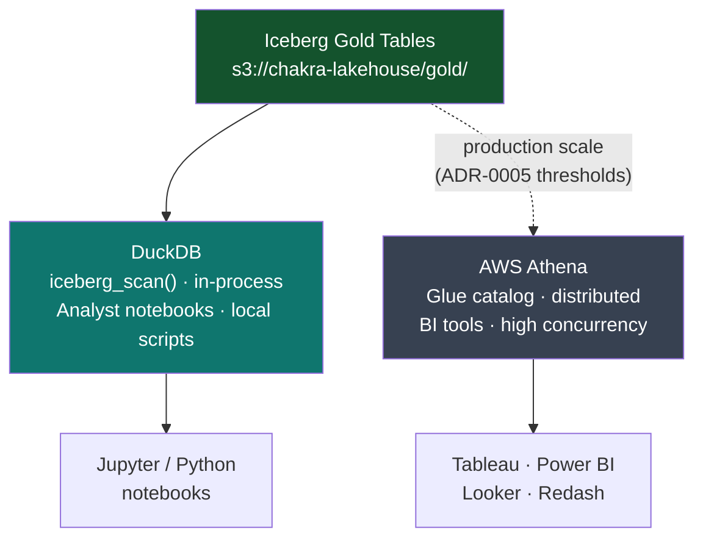

# Serving Layer

Gold-layer Iceberg tables are queried directly by DuckDB — no dedicated query server, no data movement. Analysts get sub-second cold-start times and the full power of SQL. When concurrency or scan volume outgrows DuckDB, the documented migration path is AWS Athena: same Iceberg tables, same S3 storage, zero pipeline changes.

---

## DuckDB Catalog

[`serving/duckdb/catalog.py`](https://github.com/naren-chakraview/chakraview-realtime-data-platform/blob/main/serving/duckdb/catalog.py) — Connection factory and Glue table registration.

```python
import duckdb, os

def get_connection() -> duckdb.DuckDBPyConnection:
    con = duckdb.connect()
    con.execute("INSTALL iceberg; LOAD iceberg;")
    con.execute("INSTALL aws;     LOAD aws;")

    if os.getenv("LAKEHOUSE_ENV") == "aws":
        con.execute("CALL load_aws_credentials();")   # CREDENTIAL_CHAIN auth
        _register_glue_tables(con)
    else:
        con.execute(f"SET s3_region='{os.getenv('S3_REGION', 'us-east-1')}';")

    return con


def _register_glue_tables(con: duckdb.DuckDBPyConnection) -> None:
    tables = {
        "order_daily_summary":     "s3://chakra-lakehouse/gold/order_daily_summary/",
        "silver_orders":           "s3://chakra-lakehouse/silver/orders/orders/",
        "orders_dlq":              "s3://chakra-lakehouse/dlq/orders/",
    }
    for alias, path in tables.items():
        con.execute(f"""
            CREATE OR REPLACE VIEW {alias} AS
            SELECT * FROM iceberg_scan('{path}', allow_moved_files=true)
        """)
```

The `CREDENTIAL_CHAIN` approach (`load_aws_credentials()`) picks up IAM role credentials automatically in ECS/EKS — no hardcoded keys. Locally, `S3_REGION` + boto-style env vars are used instead.

---

## Analyst Queries

[`serving/duckdb/queries/order_analytics.sql`](https://github.com/naren-chakraview/chakraview-realtime-data-platform/blob/main/serving/duckdb/queries/order_analytics.sql)

### Revenue Trend

```sql
SELECT
    order_date,
    SUM(total_revenue_cents) / 100.0                AS revenue_usd,
    SUM(unique_customers)                           AS customers,
    ROUND(SUM(total_revenue_cents) * 1.0
          / NULLIF(SUM(total_orders), 0) / 100, 2) AS avg_order_usd
FROM iceberg_scan('s3://chakra-lakehouse/gold/order_daily_summary/')
WHERE order_date >= current_date - INTERVAL 30 DAYS
GROUP BY order_date
ORDER BY order_date;
```

### Time Travel — Point-in-Time Audit

```sql
-- Query Gold table state as of a specific timestamp
SELECT order_date, total_revenue_cents
FROM iceberg_scan(
    's3://chakra-lakehouse/gold/order_daily_summary/',
    version = '2024-03-14T00:00:00'
)
WHERE order_date = '2024-03-13';
```

Iceberg snapshot IDs or timestamps can be passed directly. This powers post-incident audits and backfill validation without needing a separate audit table.

### Freshness Check

```sql
-- Alerts if Gold data is stale beyond the 5-minute SLA
SELECT
    MAX(updated_at)                                        AS last_updated,
    NOW() - MAX(updated_at)                                AS staleness,
    CASE WHEN NOW() - MAX(updated_at) > INTERVAL 5 MINUTES
         THEN 'SLA_BREACH' ELSE 'OK' END                   AS status
FROM iceberg_scan('s3://chakra-lakehouse/gold/order_daily_summary/');
```

### DLQ Audit

```sql
-- Hourly DLQ failure counts by stage and reason — surfaced in Grafana
SELECT
    DATE_TRUNC('hour', failed_at)  AS hour,
    failure_stage,
    failure_reason,
    COUNT(*)                       AS event_count
FROM iceberg_scan('s3://chakra-lakehouse/dlq/orders/')
WHERE failed_at >= NOW() - INTERVAL 24 HOURS
GROUP BY 1, 2, 3
ORDER BY 1 DESC, 4 DESC;
```

---

## Production-Scale Path: AWS Athena

DuckDB is the right choice for the reference implementation: zero infrastructure, instant startup, full Iceberg support. When usage patterns cross any of these thresholds, Athena is the documented production path.

| Threshold | Reason to migrate |
|---|---|
| > 10 concurrent users | DuckDB is single-process; Athena scales query workers horizontally |
| > 50 GB per query scan | DuckDB loads data into memory; Athena pushes predicates to S3 Select |
| BI tool JDBC/ODBC required | DuckDB has no persistent server; Athena exposes a JDBC endpoint |
| Audit logging required | Athena logs every query to CloudTrail; DuckDB has none |

### Migration Procedure

The tables are already in Iceberg on S3. Migration is a registration step, not a data movement step.

```bash
# 1. Register Gold tables in AWS Glue (one-time)
aws glue create-table \
  --database-name chakra_lakehouse \
  --table-input '{
    "Name": "order_daily_summary",
    "StorageDescriptor": {
      "Location": "s3://chakra-lakehouse/gold/order_daily_summary/",
      "InputFormat": "org.apache.iceberg.mr.mapred.IcebergInputFormat"
    },
    "Parameters": { "table_type": "ICEBERG" }
  }'

# 2. Update analyst queries: replace iceberg_scan() with table name
--  BEFORE: FROM iceberg_scan('s3://chakra-lakehouse/gold/order_daily_summary/')
--  AFTER:  FROM chakra_lakehouse.order_daily_summary

# 3. Grant Athena workgroup access via IAM
aws iam attach-role-policy \
  --role-name analysts \
  --policy-arn arn:aws:iam::aws:policy/AmazonAthenaFullAccess
```

The Flink pipeline and dbt models are unchanged. The schema contract in `contracts/data-products/orders-analytics.yaml` is unchanged. The Gold Iceberg table is unchanged. Only the query engine changes.

---

## Serving Architecture



[:octicons-arrow-right-24: ADR-0005: DuckDB Serving Layer](../adrs/ADR-0005-duckdb-serving-layer.md) — Full decision rationale, Trino comparison, and Athena migration criteria.
